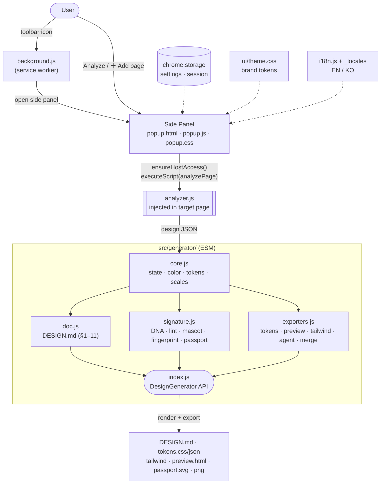

# Azuki — Design Spec Extractor

A Chrome extension that analyzes the design of the web page you're viewing and auto-generates a **DESIGN.md** document plus design tokens — a spec that AI coding agents can use directly.

[](LICENSE)
[](https://developer.chrome.com/docs/extensions/mv3/intro/)


**GitHub:** https://github.com/azuki-laboratory/design-spec-extractor · **한국어:** [README.md](README.md)

## Generated document (DESIGN.md)

1. **Visual Theme & Atmosphere** — dark/light detection, mood description + **Design DNA** tags
2. **Color Palette & Roles** — auto-assigned Background / Text / Primary / Accent / Border + the site's own CSS custom properties
3. **Typography Rules** — font families, H1–H6 specs, type scale, weights
4. **Component Styling** — buttons (Primary/Secondary clustering), inputs, cards, nav, **badges/tags · form controls · tables** + `:hover`/`:focus` rules
5. **Layout Principles** — spacing scale, gap, flex/grid ratio, centered container max-width
6. **Depth & Elevation** — shadow elevation, radius/border-width/opacity scales, z-index, motion (transition/easing/animation)
7. **Do's and Don'ts** — guardrails auto-derived from extracted tokens
8. **Responsive Behavior** — breakpoints, mobile strategy
9. **Agent Prompt Guide** — ready-to-paste prompts pre-filled with real token values
10. **Design Lint** — diagnoses where the page violates its own tokens (contrast, off-grid, off-scale radius)
11. **Accessibility & Assets** — heading order, image alt coverage, landmarks, inline SVG icons

## Signature features

- **Design Passport (passport.svg)** + **fingerprint code** (`AZ-XXXX-XXXX`) — one-card identity summary and cross-site comparison
- **Agent prompt copy** — token-filled prompt straight to the clipboard
- **Multi-page merge** — combine several pages into one spec
- **Exports** — DESIGN.md · tokens.css · tokens.json · tailwind.config.js · preview.html · passport.svg · screenshot
- **i18n (EN/KO)** — UI + generated-doc toggle; manifest localized via chrome.i18n

## Install (developer mode)

1. Open `chrome://extensions` → enable **Developer mode** (top right)
2. Click **Load unpacked** → select this repository folder

## Usage

1. Click the **Azuki icon** in the toolbar → the side panel opens
2. **Analyze this page** (release build prompts once for site access)
3. (Optional) Navigate to another page → **＋ Add page** to merge
4. Review the preview, then export (copy/download)

---

# Architecture

## Design principles

| Principle | Why |
|-----------|-----|
| **No bundler · native ESM** | MV3 extension pages / module SW support `import/export` natively. Source == release, no build step. |
| **Logic files shared by dev & release** | No build-specific branching. Permission differences live only in the manifest (build.js trims them). |
| **Minimal install permissions** | Release installs with no `host_permissions` → avoids the "read all sites" warning. Site access is requested at analysis time. |
| **Assume untrusted input** | Analyzed pages may be malicious → all page-derived values injected into outputs (preview.html/passport) are sanitized. |

## File structure

```
manifest.json          MV3 manifest (paths under src/…, broad perms for dev)
_locales/en·ko/        chrome.i18n — localized manifest strings (name/description/tooltip)
icons/                 extension icons + mascot art
src/
  analyzer.js          [injected] self-contained analysis fn run in the page context
  background.js        [SW] icon click → open side panel + dev hotreload
  popup.html/.js/.css  [panel] run analysis, preview, export UI
  options.html/.js/.css[settings] options, language, contact
  i18n.js              runtime UI strings (en/ko) + apply helpers
  ui/theme.css         shared brand tokens (:root) + reset (single source, BRAND.md)
  generator/           analysis JSON → docs/tokens/signature (ESM modules)
    core.js            shared state · color/token/scale/mood/frontmatter engine
    doc.js             generate() — assembles DESIGN.md (sections 1–11)
    signature.js       computeDNA · computeLint · mascotComment · designFingerprint · exportPassport
    exporters.js       exportTokens/Preview/Tailwind/AgentPrompt · merge (multi-page)
    index.js           assembles the public DesignGenerator API
scripts/               build (release) · check (syntax lint) · publish · icons
test/                  e2e (Playwright) · fixture · release (release smoke)
```

## Data flow



- **Multi-page**: the side panel never closes → `analyses[]` stays in memory → `merge()` regenerates the combined spec.
- **The panel performs analysis** (background only opens the panel). executeScript runs right after a user gesture (button).
- **generator**: untrusted input → `exporters` sanitizes outputs with `htmlEsc`+`cssSafe`.

## Module responsibilities

| Module | Responsibility | Key constraint |
|--------|----------------|----------------|
| `analyzer.js` | Collect page design values → JSON | **Must be self-contained** — executeScript serializes the function, so outer-scope/import refs throw at runtime |
| `generator/core.js` | Shared state · color math · token builders · scale detection | i18n via `state.LANG`/`T(en,ko)`, color tokens memoized per LANG |
| `generator/doc.js` | Assemble the DESIGN.md markdown | consumes `core` + `signature` |
| `generator/signature.js` | Azuki signatures (DNA/lint/mascot/fingerprint/passport) | fingerprint is a deterministic hash (stable per site) |
| `generator/exporters.js` | tokens/preview/tailwind/agent prompt · merge | **security sanitization**: `htmlEsc`+`cssSafe` block preview.html XSS |
| `popup.js` | Trigger analysis · render · export | no host perm in release → `ensureHostAccess()` first |
| `background.js` | Open panel + hotreload | performs no analysis |

## Internationalization (two layers)

| Layer | Scope | Mechanism | Language source |
|-------|-------|-----------|-----------------|
| Runtime | panel/settings UI + generated docs | `i18n.js` (`AZUKI_UI`) + generator `T()` | **user toggle** (storage.sync.lang) |
| Manifest | extension name/description/tooltip | chrome.i18n + `_locales` + `__MSG__` | **browser UI language** |

## Permissions

| Permission | Reason |
|------------|--------|
| `activeTab` + `scripting` | Inject the analysis fn into the current tab on an icon/button gesture |
| `downloads` | Save output files |
| `sidePanel` | Result UI in the side panel |
| `storage` | Store settings/session results locally (no external transfer) |
| `optional_host_permissions` | Read arbitrary site styles — requested **at Analyze-button click**, not at install |

> `tabs`/`host_permissions` are dev/E2E only → removed from the release build by `scripts/build.js`.

## Build · Test · Versioning

```bash
npm run lint          # syntax-check all sources (ESM/CJS aware)
npm test              # functional E2E (Playwright) — required after analyzer/generator/popup changes
npm run build         # dist/release/ + dist/azuki-v<version>.zip
npm run test:release  # release build smoke test
npm run verify        # all of the above (full gate)
npm run publish       # store upload+submit (never without human confirmation)
```

**Versioning (MAJOR.MINOR.PATCH)** — MAJOR: major logic/structure change / MINOR: feature add or change / PATCH: copy or minor UI. Keep manifest & package in sync.

**Release verification**: E2E analyzes the fixture with the dev manifest (broad perms) and asserts values. Real icon-click gestures can't be automated → verify the release zip once manually before upload.

## Known limitations

- **Cross-origin CSS**: stylesheets from other domains may block `:hover`/media-query extraction due to CORS (computed-style analysis still works).
- **Primary/Secondary detection** is a saturation/frequency heuristic — review recommended.
- Element scan cap for performance (default 4,000, adjustable in settings).
- Does not run on internal pages like `chrome://`.
