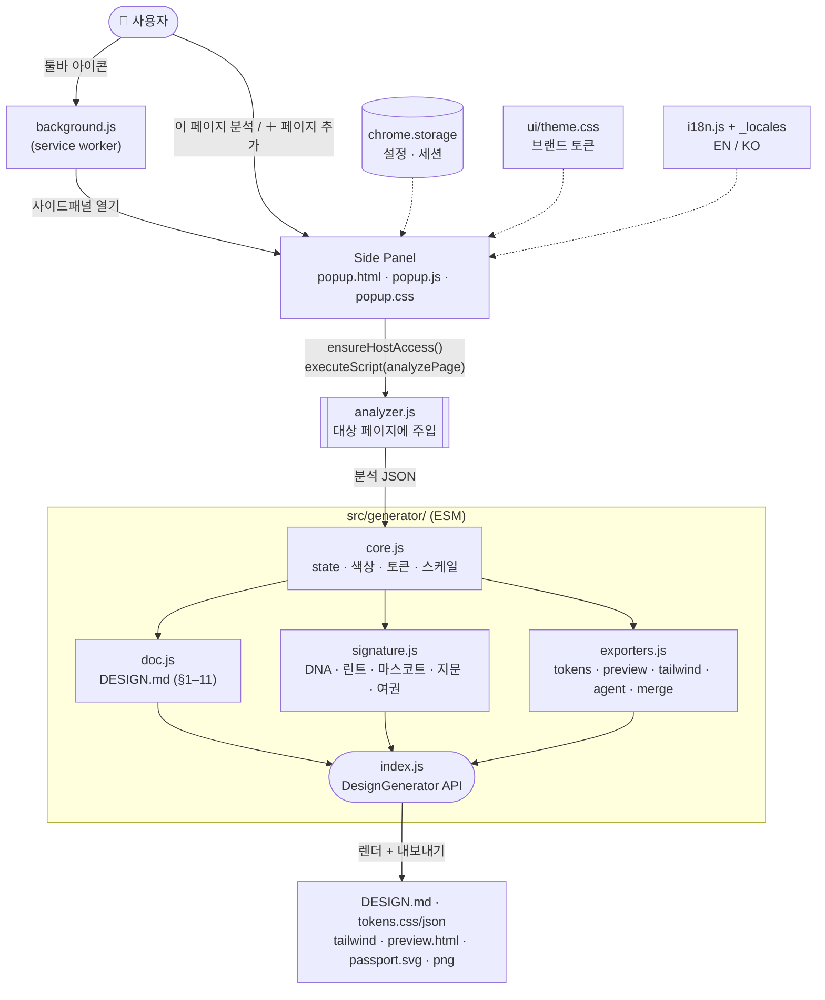

# Azuki — Design Spec Extractor

현재 보고 있는 웹사이트의 디자인을 분석하여 **DESIGN.md** 문서와 디자인 토큰을 자동 생성하는 크롬 확장 프로그램입니다. AI 코딩 에이전트가 바로 쓸 수 있는 스펙을 만듭니다.

[](LICENSE)
[](https://developer.chrome.com/docs/extensions/mv3/intro/)


[](https://github.com/azuki-laboratory/design-spec-extractor)

[](README.md)
[](README.en.md)

## 생성되는 문서 구조 (DESIGN.md)

1. **시각적 테마 및 분위기** — 다크/라이트 판별, 분위기 서술 + **디자인 DNA** 태그
2. **컬러 팔레트 및 역할** — Background / Text / Primary / Accent / Border 역할 자동 배정 + 사이트 CSS 커스텀 프로퍼티(원본 토큰) 추출
3. **타이포그래피 규칙** — 폰트 패밀리, H1~H6 스펙, 타입 스케일, 굵기
4. **컴포넌트 스타일링** — 버튼(Primary/Secondary 클러스터링), 입력창, 카드, 내비, **배지/태그·폼 컨트롤·테이블** + `:hover`/`:focus` 규칙
5. **레이아웃 원칙** — 여백 스케일, gap, flex/grid 비중, 중앙 컨테이너 max-width
6. **깊이감 및 고도** — 그림자 elevation, 반경·테두리 두께·불투명도 스케일, z-index, 모션(전환·이징·애니메이션)
7. **Do's and Don'ts** — 추출 토큰 기반 가드레일 자동 생성
8. **반응형 동작** — 브레이크포인트, 모바일 전략
9. **에이전트 프롬프트 가이드** — 토큰 값이 채워진, AI에 바로 붙여넣을 프롬프트 셋
10. **디자인 린트** — 페이지가 자기 토큰을 어기는 지점 진단(대비·그리드 이탈·반경 이탈)
11. **접근성 & 자산** — 제목 순서·이미지 alt 커버리지·랜드마크·인라인 SVG 아이콘

## 시그니처 기능

- **디자인 여권(passport.svg)** + **지문 코드**(`AZ-XXXX-XXXX`) — 사이트 디자인 정체성 한 장 요약·대조
- **에이전트 프롬프트 복사** — 토큰이 채워진 프롬프트를 클립보드로
- **다중 페이지 병합** — 여러 페이지를 하나의 스펙으로
- **내보내기** — DESIGN.md · tokens.css · tokens.json · tailwind.config.js · preview.html · passport.svg · screenshot
- **다국어(EN/KO)** — UI·생성문서 토글 + manifest는 chrome.i18n 현지화

## 설치 (개발자 모드)

1. `chrome://extensions` 접속 → 우측 상단 **개발자 모드** 켜기
2. **압축해제된 확장 프로그램을 로드** 클릭 → 이 저장소 폴더 선택

## 사용법

1. 툴바 **Azuki 아이콘** 클릭 → 사이드패널 열림
2. **이 페이지 분석하기** (배포 빌드는 최초 1회 사이트 접근 허용 팝업)
3. (선택) 다른 페이지로 이동 → **＋ 페이지 추가** 로 병합
4. 미리보기 확인 후 내보내기(복사/다운로드)

---

# 아키텍처 설계서

## 설계 원칙

| 원칙 | 이유 |
|------|------|
| **번들러 없음 · 네이티브 ESM** | MV3 확장 페이지·모듈 SW는 `import/export` 네이티브 지원. 빌드 스텝 없이 소스 = 배포. |
| **로직 파일 개발·배포 공용** | 빌드별 분기 코드 금지. 권한 차이는 manifest에서만(build.js가 축소). |
| **최소 설치 권한** | 배포는 `host_permissions` 없이 설치 → "모든 사이트 읽기" 경고 회피. 사이트 접근은 분석 시 런타임 요청. |
| **신뢰 불가 입력 가정** | 분석 대상은 악성 가능 → 생성물(preview.html/passport)에 삽입되는 페이지 값은 전부 이스케이프·정제. |

## 파일 구조

```
manifest.json          MV3 매니페스트 (경로는 src/…, 개발용 넓은 권한)
_locales/en·ko/        chrome.i18n — manifest 문자열 현지화(name/description/tooltip)
icons/                 확장 아이콘 + 마스코트 원화
src/
  analyzer.js          [주입] 페이지 컨텍스트서 실행되는 자기완결 분석 함수
  background.js        [SW] 아이콘 클릭 → 사이드패널 열기 + 개발 hotreload
  popup.html/.js/.css  [패널] 분석 실행·미리보기·내보내기 UI
  options.html/.js/.css[설정] 옵션·언어·문의
  i18n.js              런타임 UI 문자열(en/ko) + 적용 헬퍼
  ui/theme.css         공용 브랜드 토큰(:root)·리셋 (BRAND.md 단일 출처)
  generator/           분석 JSON → 문서/토큰/시그니처 (ESM 모듈)
    core.js            공유 state·색상/토큰/스케일/무드/frontmatter 엔진
    doc.js             generate() — DESIGN.md 조립(섹션 1~11)
    signature.js       computeDNA·computeLint·mascotComment·designFingerprint·exportPassport
    exporters.js       exportTokens/Preview/Tailwind/AgentPrompt · merge(멀티페이지)
    index.js           DesignGenerator 공개 API 조립
scripts/               build(배포) · check(문법린트) · publish · icons
test/                  e2e(Playwright) · fixture · release(배포 스모크)
```

## 데이터 흐름



- **다중 페이지**: 패널이 사이드패널이라 안 닫힘 → `analyses[]` 메모리 유지 → `merge()`로 병합 재생성.
- **분석은 패널이 수행**(background는 패널 열기만). executeScript는 사용자 제스처(버튼) 직후.
- **generator**: 신뢰불가 입력 → `exporters`가 `htmlEsc`+`cssSafe`로 산출물 이스케이프·정제.

## 모듈 책임

| 모듈 | 책임 | 핵심 제약 |
|------|------|-----------|
| `analyzer.js` | 페이지 디자인 값 수집 → JSON | **자기완결 필수** — `executeScript`가 함수를 직렬화하므로 외부 스코프·import 참조 시 런타임 에러 |
| `generator/core.js` | 공유 상태·색상 수학·토큰 빌더·스케일 검출 | `state.LANG`·`T(en,ko)`로 다국어, 색상토큰 LANG별 메모 |
| `generator/doc.js` | DESIGN.md 마크다운 조립 | `core` + `signature` 소비 |
| `generator/signature.js` | Azuki 시그니처(DNA/린트/마스코트/지문/여권) | 지문은 결정적 해시(같은 사이트 동일) |
| `generator/exporters.js` | 토큰/미리보기/tailwind/에이전트 프롬프트·병합 | **보안 정제**: `htmlEsc`+`cssSafe`로 preview.html XSS 차단 |
| `popup.js` | 분석 트리거·렌더·내보내기 | 배포 host 권한 없음 → `ensureHostAccess()` 선행 |
| `background.js` | 패널 열기 + hotreload | 분석 안 함 |

## 국제화 (2계층)

| 계층 | 대상 | 메커니즘 | 언어 결정 |
|------|------|----------|-----------|
| 런타임 | 패널·설정 UI·생성 문서 | `i18n.js`(`AZUKI_UI`) + generator `T()` | **사용자 토글**(storage.sync.lang) |
| manifest | 확장명·설명·툴팁 | chrome.i18n + `_locales` + `__MSG__` | **브라우저 UI 언어** |

## 권한

| 권한 | 사유 |
|------|------|
| `activeTab` + `scripting` | 아이콘/버튼 제스처로 현재 탭에 분석 함수 주입 |
| `downloads` | 산출물 파일 저장 |
| `sidePanel` | 결과 UI 사이드패널 |
| `storage` | 사용자 설정·세션 결과 로컬 저장(외부 전송 없음) |
| `optional_host_permissions` | 임의 사이트 스타일 읽기 — 설치 시 아닌 **분석 버튼 클릭 시 런타임 요청** |

> `tabs`·`host_permissions`는 개발/E2E 전용 → `scripts/build.js`가 배포 빌드에서 제거.

## 빌드 · 테스트 · 버전

```bash
npm run lint          # 전 소스 문법 검사 (ESM/CJS 구분)
npm test              # 기능 E2E (Playwright) — analyzer/generator/popup 수정 후 필수
npm run build         # dist/release/ + dist/azuki-v<버전>.zip
npm run test:release  # 배포 빌드 스모크
npm run verify        # 위 전부 한 번에 (전체 게이트)
npm run publish       # 스토어 업로드+제출 (사람 확인 없이 금지)
```

**버전 규칙(MAJOR.MINOR.PATCH)** — MAJOR: 주요 로직·구조 변경 / MINOR: 기능 추가·수정 / PATCH: 문구·미세 UI. manifest·package 동기.

**배포 검증**: E2E는 개발 manifest(넓은 권한)로 픽스처 분석 후 결과값 대조. 실제 아이콘 클릭 제스처는 자동화 불가 → 배포 zip 1회 수동 확인 후 업로드.

## 알려진 제약

- **교차 출처 CSS**: 다른 도메인 스타일시트는 CORS로 `:hover`/미디어쿼리 추출 제한(computed style 분석은 정상).
- **Primary/Secondary 판별**은 채도·빈도 휴리스틱 → 검수 권장.
- 성능상 요소 스캔 상한(기본 4,000, 설정에서 조정).
- `chrome://` 등 내부 페이지 미동작.
